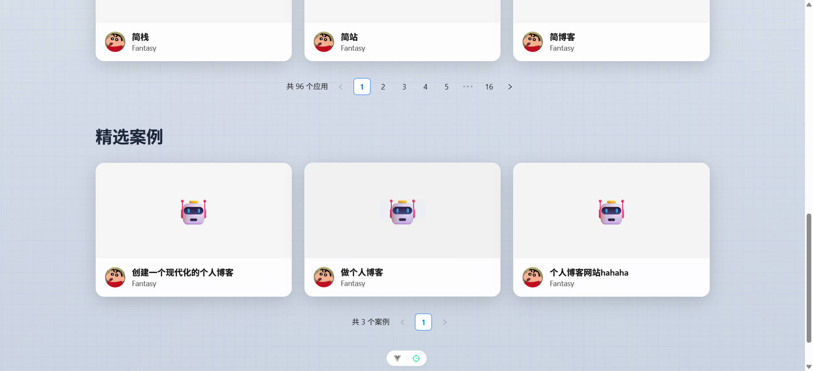

# 兔子 AI 零代码应用生成平台

## 项目概述

基于 Spring Boot 3 + LangChain4j + Vue 3 开发对标大厂的 **企业级 AI 代码生成平台**

1）智能代码生成：用户输入需求描述，AI 自动分析并选择合适的生成策略，通过工具调用生成代码文件，采用流式输出让用户实时看到 AI 的执行过程。

2）可视化编辑：生成的应用将实时展示，可以进入编辑模式，自由选择网页元素并且和 AI 对话来快速修改页面，直到满意为止。

3）一键部署分享：可以将生成的应用一键部署到云端并自动截取封面图，获得可访问的地址进行分享，同时支持完整项目源码下载。

查看精选案例：

核心业务流程：

架构设计：

## 技术选型

### 后端技术栈

| 技术             | 版本   | 用途                   |
| ---------------- | ------ | ---------------------- |
| **Spring Boot**  | 3.5.4  | 主框架                 |
| **Java**         | JDK 21 | 运行时（支持虚拟线程） |
| **LangChain4j**  | 1.1.0  | AI集成框架             |
| **MySQL**        | 8.0+   | 主数据库               |
| **MyBatis-Flex** | -      | ORM框架                |
| **Redis**        | 6.0+   | 分布式缓存和会话       |
| **Caffeine**     | -      | 本地缓存               |
| **Selenium**     | -      | 网页截图               |
| **腾讯云COS**    | -      | 对象存储               |

### 前端技术栈

| 技术               | 版本 | 用途                        |
| ------------------ | ---- | --------------------------- |
| **Vue 3**          | 3.4+ | 前端框架（Composition API） |
| **TypeScript**     | 5.0+ | 类型系统                    |
| **Ant Design Vue** | 4.x  | UI组件库                    |
| **Pinia**          | -    | 状态管理                    |
| **Vue Router**     | 4.x  | 路由管理                    |
| **Vite**           | -    | 构建工具                    |
